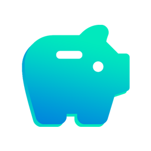

  

#

Welcome to Piggsy: your personal piggy bank manager that makes saving money for your goals fun, easy, and totally customizable. Whether you're stashing cash for a dream vacation, a new gadget, or just building an emergency fund, Piggsy lets you create multiple piggy banks with your own currencies, deadlines, and notes to keep you motivated and on track.

With a sleek, modern design and a user-friendly interface, Piggsy turns saving into something you actually want to do. No more boring spreadsheets or guessing games. Just clear progress, flexible goals, and everything in one place.

## Features

- **Create Multiple Piggy Banks:** Set up as many savings goals as you want, each with its own target amount, currency, and deadline
- **Custom Currencies:** Save in any real currency you prefer: dollars, euros, yen, and more
- **Add and Deduct Transactions:** Easily add or remove money from your piggy banks to keep your balance accurate
- **Deadline Tracking:** Add optional deadlines to stay motivated and see how close you are to your goal
- **Modern & Intuitive UI:** Enjoy a clean, attractive interface with dynamic color themes
- **Organize with Archiving:** Archive piggy banks that you’ve completed or paused to keep your active goals clutter-free
- **Export & Import Data:** Backup or transfer your savings easily with JSON export/import
- **Flexible Sorting:** Sort your piggy banks by name, progress, goal amount, or deadline

## Screenshots

  
  
  
  

## Download

  

## License

This project is licensed under the GNU General Public License v3.0. See the
[LICENSE](LICENSE) file for details.

## Credits

Piggsy is a fork of [Centsation](https://github.com/eipna/centsation) by [eipna](https://github.com/eipna).

