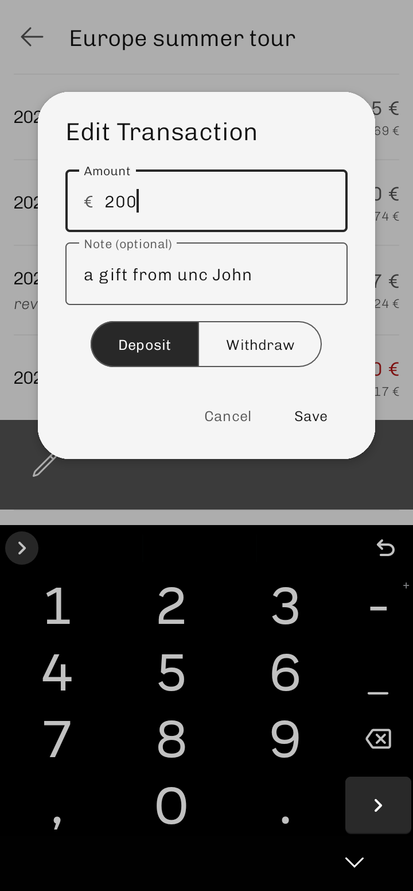
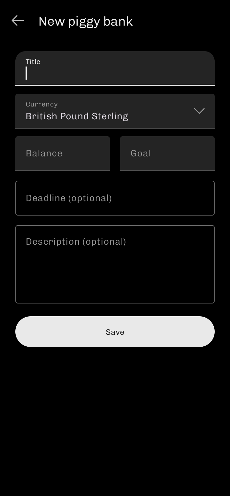

  

#

Welcome to Piggsy – a simple piggy bank manager for tracking your savings goals in one place.

Whether you're saving for a trip, a new gadget, or an emergency fund, Piggsy lets you create multiple piggy banks with your preferred currency, optional deadlines, and notes to help you stay organized.

The app focuses on a clean, straightforward experience with an interface that’s easy to use and visually modern. Instead of spreadsheets or manual tracking, you get a clear view of your progress and all your goals in one place.

## Features

- **Create multiple piggy banks**  
  Set up as many savings goals as you need, each with its own target, currency, and optional deadline.

- **Choose your currency**  
  Save in the currency that makes sense for you: USD, EUR, JPY, and others.

- **Track deposits and withdrawals**  
  Add or deduct money anytime to keep your balance up to date. With full transaction history and short notes you have more control over your piggy banks than ever.

- **Optional deadlines**  
  Add a deadline to stay on track and see how close you are to reaching your goal.

- **Archive completed or paused goals**  
  Keep your active list focused by archiving piggy banks you’re not using.

- **Sort your piggy banks**  
  Organize them by name, progress, goal amount, or deadline.

- **Backup and restore your data**  
  Automatic backups tailored to your needs. Set up once and never lose your data.

## Screenshots

  
  
  
  

## Download

  
  

## License

This project is licensed under the GNU General Public License v3.0. See the
[LICENSE](LICENSE) file for details.

It also uses [icons](https://composables.com/icons/icon-libraries/heroicons/outline) licensed under the [MIT License](https://opensource.org/license/MIT).

## Credits

Piggsy is a fork of [Centsation](https://github.com/mowtiie/centsation) by [mowtiie](https://github.com/mowtiie).

