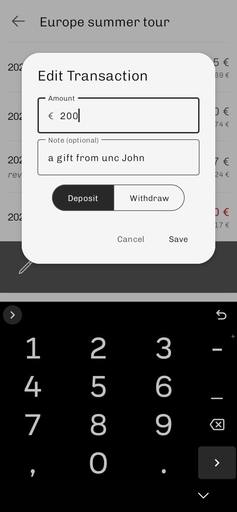
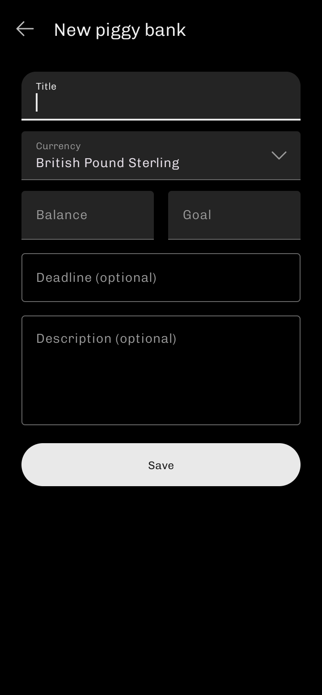

  

#

Welcome to Piggsy — a simple way to keep track of your savings goals, all in one place.

Whether you're saving for a trip, a new gadget, or an emergency fund, this app lets you create multiple piggy banks with your preferred currency, optional deadlines, and notes to help you stay organized.

## Features

- **Multiple piggy banks**  
  Create as many savings goals as you need. Each piggy bank has its own target amount, currency, optional deadline, and notes.

- **Track deposits and withdrawals**  
  Add or withdraw money whenever you need to keep your balance up to date. Each piggy bank keeps a full transaction history, with optional notes for individual transactions.

- **Deadlines**  
  Assign a specific day in the calendar and get a notification when the deadline is reached.

- **Set up automatic backups**  
  Back up your data every few days, so your savings goals and transaction history don't get lost. Everything behind the scenes.

## Screenshots

  
  
  
  

## Download

  
  
  

## License

This project is licensed under the GNU General Public License v3.0. See the
[LICENSE](LICENSE) file for details.

It also uses [icons](https://composables.com/icons/icon-libraries/heroicons/outline) licensed under the [MIT License](https://opensource.org/license/MIT).

## Credits

Piggsy is a fork of [Centsation](https://github.com/mowtiie/centsation) by [mowtiie](https://github.com/mowtiie).

